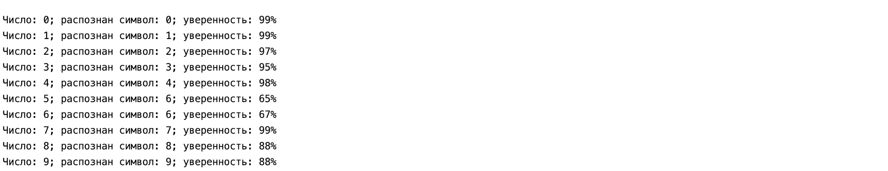

# Генетический алгоритм

##### Конфигурация проекта
* Ruby: ruby-2.5.1

##### Запуск проекта
* склонировать проект
* перейти в корневую дерикторию проекта
* в терминале ввести команду (предварительно требуется установить Ruby)
```
ruby main.rb
```
##### Установка Ruby 
(желательно использовать один из менеджеров версий rbenv, rvm, chruby на выбор)
* Homebrew (macOS)
```
brew install ruby
```
* apt (Debian, Ubuntu, Mint)
```
sudo apt-get install ruby-full
```
* yum (Fedora, CentOS)
```
sudo yum install ruby
```
#### Обратное распространение ошибки
* 1000 - количество эпох обучения
* 0.05 - коэффициент обучения


#### Генетический алгоритм
1) Выбор родителей происходит методом рулеточного отбора
2) Отбор особей в следующее поколение происходит методом вытеснения
3) Мутация будет происходить с синпатическим весом 
4) Проверка выполнения условия будет по критерию общей ошибки